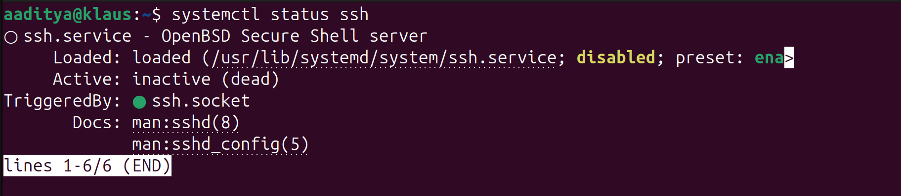

# Linux Architecture – Quick Notes (Day 02)

## 1. Core Components of Linux

### Kernel
- The **core of the OS**
- Manages:
  - CPU scheduling
  - Memory
  - Hardware devices
  - Process management
- Runs in **kernel space** (full system access)

### User Space
- Where **applications and users** live
- Includes:
  - Shell (bash)
  - Commands (ls, ps, top)
  - System services
- Cannot access hardware directly (talks to kernel via syscalls)

### Init System (systemd)
- First process started by the kernel (**PID 1**)
- Responsible for:
  - Starting services
  - Managing system boot
  - Handling restarts and logs

---

## 2. How Processes Work in Linux

### Process Creation
- A new process is created using:
  - `fork()` → creates a copy of the process
  - `exec()` → replaces it with a new program
- Every process has:
  - **PID** (Process ID)
  - **PPID** (Parent Process ID)

### Process States
- **Running (R)** – actively using CPU
- **Sleeping (S)** – waiting for I/O or event
- **Uninterruptible Sleep (D)** – waiting for disk/network
- **Stopped (T)** – paused manually
- **Zombie (Z)** – finished but not cleaned by parent

---

## 3. What systemd Does (and Why It Matters)

- Manages system **services, sockets, mounts**
- Replaces older init systems (SysVinit)
- Key benefits:
  - Faster boot
  - Automatic restarts
  - Centralized logging
  - Dependency handling

### Important systemd Concepts
- **Unit files** → define services (`.service`)
- **Targets** → system states (like runlevels)

---

## 4. Daily Linux Commands (DevOps Basics)

1. `ps aux` – View running processes
2. `top` / `htop` – Monitor CPU and memory usage
3. `systemctl status <service>` – Check service health
4. `journalctl -u <service>` – View service logs
5. `kill <PID>` – Stop a process

---

## 5. Why This Matters for DevOps

- Helps debug:
  - Crashed services
  - High CPU or memory usage
  - Failed restarts
- Makes incident response faster and calmer
- Builds confidence in production environments

---

## 6. TRY

```systemctl status ssh```




